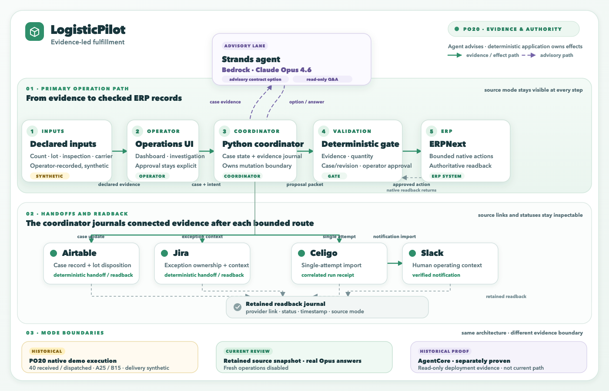

# LogisticPilot

Newest acceptance: [economic decision → ERP dispatch](docs/audits/2026-09-13-economic-poc-acceptance.md). An isolated 25-unit order now has a real Bedrock comparison and an approved 20-unit native ERP dispatch, with 5 units still held. The $24.80 postage difference is a conditional estimate, not realized savings.

Earlier release evidence: [PO20 claim manifest](docs/submission/current-claim-manifest.md) · [strict judge review](docs/audits/2026-09-13-award-readiness.md). Older invoice and multi-agent results remain separate cases.

> **September 13 current status:** The retained PO20 review and real Claude Opus
> 4.6 application answers are verified in the isolated workspace. Historical ERP
> evidence records 40 received / 40 dispatched, allocated A25/B15. See the
> [September 12 runtime restoration audit](docs/audits/2026-09-12-runtime-restoration.md)
> and [Opus access/application audit](docs/audits/2026-09-12-opus-restoration.md).


**An AI order desk for small distributors: resolve delivery exceptions, keep orders moving, and avoid unnecessary costs.**

LogisticPilot helps parts distributors turn one receiving exception into a
reviewable fulfillment workflow. Operators record carton, quantity, lot, and
inspection evidence; a Strands agent selects among explicit customer contracts,
while deterministic code owns quantities, authority, ERP effects, and readback.[^heritage]

[^heritage]: LogisticPilot was formerly named The Missing 20. Historical audit paths,
code package names, environment variables, case IDs, and runtime database names
retain the former name for traceability.

The retained PO20 demonstration follows isolated case
`M20-DIST-COMPONENT-V2-20260910` on `PUR-ORD-2026-00020`: 40 parts ordered,
received, and dispatched. LOT-A20 records 20 parts; LOT-B18 records 18 of 20 after a
two-part shortage and sample failure, then passes a whole-lot retest; LOT-C2 records
the two-part replacement. Shipments 16–19 dispatch 20, 5, 13, and 2 parts to fulfill
customer commitments A25 and B15. Delivery confirmations are synthetic demo inputs,
not independent proof that customers physically received the parts. The PO is USD160;
customer orders are USD150 and USD90; no invoice, payment, or revenue-recognition
claim is made.

The new economic demonstration uses `LP-POC-COST-01`, mapped to isolated runtime
case `M20-DIST-ECONOMIC-ECON-20260913`, PO23 and SO17. Its 25-unit synthetic order
compares sending 20 qualified parts now and 5 later against waiting for all 25.
Real Strands/Bedrock calls read contract, quality, rate and stock evidence; the
operator's supported choice passes through the existing approval and ERP executor.
The verified result is 20 units recorded as dispatched in ERP and 5 held, with no
carrier booking or payment. Consolidating all 25 remains advice only. See the
[evidence packet](docs/demo-data/economic-poc/README.md) and acceptance audit.

## Why this needs an agent

For PO20, the agent explains inspection coverage and selects among supplied, versioned customer-contract options. Deterministic code computes feasible quantities and validates the selection. A held-out comparison against rules alone has not yet established the agent's incremental value.

The broader investigation questions below also describe earlier recovery paths. They do not mean every source tool executes in today's retained PO20 conversation.

The visible quantity mismatch is only the symptom. Before anyone retries a receipt,
releases a lot, or posts an invoice, the operator must answer questions spread across
five systems:

- Did the physical shipment arrive, and do Stock Ledger and GL agree?
- Does ERP already contain the integration business key?
- Is the exact supplier lot approved, held, or mismatched?
- Did the Celigo attempt commit, acknowledge, or disappear after a timeout?
- Do Jira and Slack provide context, or only unverified human assertions?
- Is the customer order safe to deliver and bill without creating a duplicate effect?

The Strands loop performs that evidence work. Deterministic code—not the model—owns
state classification, action eligibility, approval binding, execution, verification,
and replay safety.

## Retained historical 20-unit evidence

The following separately accepted September 7 case remains useful historical evidence;
it is not connected to the current PO20 receiving path.

1. **Detect** — an external demo-system change advances the source version and the
   ordered event ledger; the Dashboard never animates invented traffic.
2. **Investigate** — Strands runs six bounded read/reconciliation tools, reconciles records, tests
   competing causes, and streams SDK hooks, evidence, latency, tokens, and uncertainty.
3. **Ask** — the operator holds a multi-turn, case-scoped conversation with the Agent
   and can open every cited source record.
4. **Decide** — deterministic policy prepares one exact recovery packet. The Manager
   may approve or reject; stale evidence fails closed.
5. **Recover** — the guarded executor applies only the approved, idempotent ERPNext
   demo-tenant execution bundle.
6. **Verify** — fresh provider reads prove 20/20 delivered, Sales Order
   `SAL-ORD-2026-00006`, Delivery Note `MAT-DN-2026-00001`, Sales Invoice
   `ACC-SINV-2026-00006`, USD 42,000 billed, balanced Stock/GL entries, and the exact
   Celigo run receipt. Duplicate protection is covered separately by deterministic
   idempotency regression tests; this live capture does not claim a second replay attempt.

## Architecture



The current recording architecture follows synthetic demo inputs—operator, scanner,
inspection, and carrier—through the Operations UI, the Python operation coordinator,
the Strands contract selector, the deterministic evidence gate, and validated ERPNext
actions. The recorded English Dashboard conversation uses Strands with direct Amazon
Bedrock Claude Opus 4.6. The coordinator sends direct
case updates to Airtable and Jira; Celigo carries the single-attempt Slack import.
Connected-mode conversation can read fresh ERP facts and retained handoff journal evidence
through an SDK session. Current review mode supplies a dated retained snapshot instead;
both conversations remain read-only. AgentCore is historical evidence only.

The model selects a versioned contract option and supplies evidence; deterministic
application code owns quantity checks, authorization, inventory writes, and native
readback. The architecture represents PO20: 40 ordered, received, and dispatched,
allocated A25/B15 through shipments 16–19 of 20, 5, 13, and 2 parts. Delivery
confirmations are explicitly synthetic demo inputs.

The earlier `docs/architecture/the-missing-20-live-architecture.english.jpg` remains
available as a clearly labeled historical view and is not evidence for the current
recording path.

Explore the [interactive current architecture](docs/architecture/distributor-operations-recording.html),
read the [architecture specification](docs/architecture/distributor-operations-recording.json),
or read the [as-built architecture](docs/architecture/as-built-architecture.md). The
current local hero UI uses direct Strands Bedrock transport and does not pretend to
route through AgentCore.

The following connection table lists the connected systems and their evidence
boundaries; the fresh-case audit is the authority for current record IDs and status.

## What is genuinely connected

| System | Evidence or effect in the hero case | Authority |
| --- | --- | --- |
| ERPNext / Frappe Cloud | PO, receipt, lot, supplier invoice, customer order, delivery, sales invoice, Stock Ledger, GL | Fresh reads plus deterministic application writes after evidence checks |
| Airtable | Exact-lot supplier-quality disposition and same-case case record | Deterministic application handoff and readback |
| Celigo | Single-attempt Slack notification import and correlated run receipt | Deterministic application handoff and readback |
| Jira | CAPA/exception ownership and workflow context | Deterministic application handoff and readback |
| Slack | Human incident context and verified notification | Notification through Celigo; readback verifies content |
| Amazon Bedrock Claude Opus 4.6 | Recorded English Dashboard conversation through Strands | Advisory only |
| Amazon Bedrock AgentCore Runtime | Separate READY deployment, invocation, logs, and role-chat proof | Read-only deployment proof |

All enterprise records are purpose-built competition data. The retained historical
ERPNext execution bundle wrote to an isolated external demo tenant and was followed by
fresh provider reads. Current distributor writes occur in deterministic application code
only after evidence checks and are followed by native readback.
No production customer data, production accuracy, AgentCore Gateway/Policy, or causal
revenue-uplift claim is presented.

## Strands usage and historical investigation evidence

Current PO20 contract selection and retained read-only conversation use Strands with
direct Bedrock Opus 4.6. The investigation/evaluator/trace capabilities below belong
to separately demonstrated historical paths. The stopped current Graph experiment
does not establish a multi-agent improvement.

The historical investigation implementation includes:

- a bounded investigation orchestrator;
- scoped ERP, registry, integration, and collaboration tools;
- structured/typed advisory output;
- competing hypotheses and explicit stop conditions;
- synthesis and evaluator feedback;
- SDK lifecycle hooks exposed as a flight recorder;
- case-scoped multi-turn conversation with evidence citations;
- a hard boundary that prevents model output from becoming business-write authority.

The retained September 6 real-provider evidence includes 8/8 ambiguous case variants
and 15/15 multi-turn cases (45 dialogue turns), including approve, reject, deny, and
needs-evidence outcomes. These are historical bounded demo-set results, not evidence
of a production SLO.

## Quick start — current `/operations` workspace

The current LogisticPilot entry is `/operations`. It requires an existing private
ERP demo case configuration, authorized Bedrock credentials, and the matching local
runtime journal. A clean clone does not contain those private records, so follow the
[current operations runbook](docs/runbooks/current-operations.md) for the exact
startup command and read-only acceptance boundary.

Prerequisites:

- Python 3.12+
- Node.js 20+
- [`uv`](https://docs.astral.sh/uv/getting-started/installation/)
- GNU `make` (macOS Command Line Tools or a standard Linux build environment)

```bash
git clone https://github.com/danielwanwx/logisticpilot.git
cd logisticpilot
```

After cloning, install the local dependencies with `make bootstrap`. Then configure
the authorized private ERP/Bedrock integrations, matching case JSON, and runtime
journal described in the runbook; those private records are not included in the
clone. Start `scripts/decision_workspace_server.py` and open
`http://127.0.0.1:8930/operations?view=dashboard`.

The older `make case-console` target is a historical offline entry for the retained
20-unit incident. It is separate from the current `/operations` receiving workflow
and does not provide a clean-clone end-to-end demonstration. `make judge-demo` checks
that historical path without cloud calls; it does not execute current receiving
operations.

### Historical `case-console` evidence

The commands below exercise the historical `case-console` path, separate from the
current `/operations` workspace.

With an authorized AWS profile and purpose-built external demo records configured in
`.env`:

```bash
AWS_CONFIRM=1 make case-console-judge
```

The application fails visibly as `DEGRADED` if the provider is unavailable; it never
substitutes a scripted model conclusion. External writes remain disabled unless
`MISSING20_ENVIRONMENT=demo` and the exact Manager-gated executor preconditions pass.

### Stop and reset

- Stop the server with `Ctrl-C`.
- Preserve `.missing20-runtime` to test durable recovery.
- For a fresh local run, use a new runtime directory:

```bash
CASE_CONSOLE_RUNTIME=.missing20-runtime-fresh make case-console
```

## Verification

Run the release-quality gate:

```bash
make check
make golden
make golden-v2
make workspace-smoke
make judge-demo
```

The credential-free `make check` gate is the repository quality check. Final video
production and Devpost upload remain in progress; passing offline checks does not turn
synthetic delivery confirmation into physical-receipt proof.

Targeted proof:

| Proof | Evidence |
| --- | --- |
| PO20 same-case fulfillment journal | [`docs/submission/video-v1/SOL-REVIEW-V2.md`](docs/submission/video-v1/SOL-REVIEW-V2.md) |
| PO20 rehearsal and capture boundary | [`docs/submission/video-v1/REHEARSAL-V2.md`](docs/submission/video-v1/REHEARSAL-V2.md) |
| Browser and end-to-end workflow | [`artifacts/workspace/browser-smoke-v1.json`](artifacts/workspace/browser-smoke-v1.json) |
| Real Strands multi-case evaluation | [`artifacts/agent/2026-09-06-hybrid-loop-8-case-real.json`](artifacts/agent/2026-09-06-hybrid-loop-8-case-real.json) |
| Human/Agent dialogue matrix | [`artifacts/agent/2026-09-06-human-agent-dialogue-matrix-final-v2.json`](artifacts/agent/2026-09-06-human-agent-dialogue-matrix-final-v2.json) |
| Manager-gated external ERPNext recovery | [`artifacts/audits/2026-09-07-current-hero-proof.json`](artifacts/audits/2026-09-07-current-hero-proof.json) + [hash-bound raw live capture](artifacts/audits/2026-09-07-current-hero-live-snapshot.json) |
| AgentCore Runtime proof | [`artifacts/aws/2026-08-29-agentcore-runtime-proof.json`](artifacts/aws/2026-08-29-agentcore-runtime-proof.json) |
| Final independent judge review | [`artifacts/audits/2026-09-07-role-judge-rerun/final-verification.md`](artifacts/audits/2026-09-07-role-judge-rerun/final-verification.md) |
| Claim boundary | [`docs/submission/evidence-matrix.md`](docs/submission/evidence-matrix.md) |

## Failure behavior

- `?mode=degraded` — the advisory provider is unavailable; deterministic truth stays
  visible, but no diagnosis is fabricated and no recovery is unlocked.
- `?mode=invalid` — authoritative lifecycle evidence is incomplete; operational claims
  and controls fail closed.
- Rejecting the Manager plan records the decision and creates zero external effects.
- Duplicate-effect protection is covered by deterministic regression tests. The
  committed live hero capture proves one Manager-approved bounded execution bundle
  producing the captured record set, not a separate replay.

## Repository map

```text
src/the_missing_20/       agent, policy, adapters, ledger, evaluation
scripts/                  server, seeders, smoke and evidence runners
workspace/                production dashboard and investigation UI
tests/ + tests-js/        unit, integration, browser and contract tests
docs/architecture/        validated architecture and as-built explanation
docs/submission/          Devpost copy, judging map, evidence and limits
artifacts/                redacted machine-readable proof and judge captures
```

## Security and authority

- Credentials remain in ignored `.env` files and never reach the browser.
- Source tools are allowlisted and read-only.
- Model output is parsed as untrusted data and is not policy input.
- Historical recovery is case-bound, Manager-gated and idempotent in the isolated ERPNext demo tenant.
- Photo receiving separately submits a confirmation-bound receipt. Its worker reconciles
  uncertain submissions by lookup, then journals configured Airtable/Slack handoffs
  and Jira exception updates. These are additional bounded write paths; advisory tools
  do not gain write authority.
- The local Manager is a declared demo persona, not an authentication claim.

See [known limitations](docs/submission/known-limitations.md) and
[project provenance](docs/provenance.md) for the complete claim boundary.

## Competition materials

- [Devpost submission draft](docs/submission/devpost-submission-draft.md)
- [Five-minute demo script](docs/demo/five-minute-demo.md)
- [Judging map](docs/submission/judging-map.md)
- [System overview](docs/submission/system-overview.md)
- [Official-requirements and prior-winner benchmark](docs/research/2026-09-07-submission-and-winner-readme-benchmark.md)

## Built with

Strands Agents SDK · Amazon Bedrock Claude Opus 4.6 · Amazon Bedrock AgentCore Runtime ·
ERPNext/Frappe Cloud · Airtable · Celigo · Jira · Slack · Python 3.12 · Pydantic ·
SQLite · Server-Sent Events · Vanilla JavaScript/CSS

## License

Project source code: [MIT](LICENSE). Third-party public photo fixtures in
`tests/fixtures/photo_receiving/` are **not MIT-licensed**: each retains the
CC BY, CC BY-SA, CC0 or public-domain terms and attribution recorded in the
[fixture manifest](tests/fixtures/photo_receiving/manifest.json).
