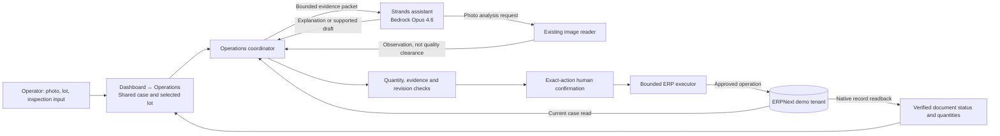

# LogisticPilot current recording architecture

This describes the connected 25-part receiving case. It supersedes PO20 diagrams
for this recording; the older assets remain historical evidence.

The assistant's current read tool returns the prefetched case packet. It is not
an independent external RPC. Structured drafts do not authorize writes. The
application enforces the current source and exact proposal scope before execution.

The verified reference case recorded 20 dispatched and five held. That proves
demo ERP behavior, not physical shipment, payment or production impact. Photo
fixtures and business inputs are disclosed POC evidence. AgentCore, historical
multi-agent experiments and earlier SaaS handoffs are not on this runtime path.
